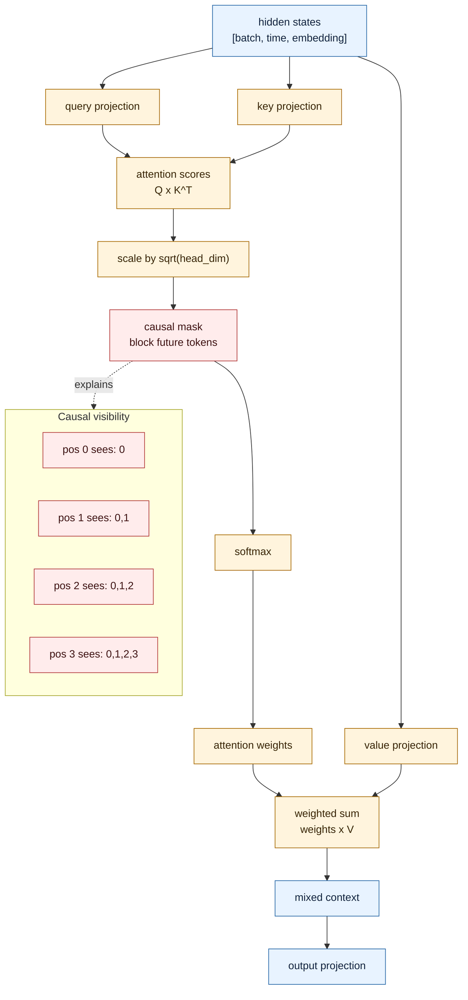

# Self-Attention: How the Model Looks Back

Predicting the next character requires context. You can't predict what comes after "The Slice L" without knowing what came before.

**Self-attention** is the mechanism that lets each position in a sequence look back at earlier positions and decide which ones are relevant.

## Where This Lives

```txt
app/attention.py
```

## A Simple Analogy

Imagine you're reading a novel and you reach the word "it". You need to figure out what "it" refers to. So you glance back at earlier sentences to find the relevant noun.

Self-attention does the same thing for tokens. Each token asks: "which earlier tokens should I pay attention to right now?" Then it collects information from those tokens.

## The Three Projections: Query, Key, Value

Every token creates three vectors from its embedding:

- **Query:** what this token is looking for
- **Key:** what this token has to offer others
- **Value:** the actual information this token will share if chosen

The match between a Query and a Key produces a score. High score = pay more attention. Then the model collects Value vectors weighted by those scores.

```txt
scores = query × key  (how much does this token care about that one?)
weights = softmax(scores)  (turn scores into percentages that sum to 1)
output = weights × value  (collect information proportionally)
```

## The Causal Mask: No Peeking at the Future

Here's a tricky part. During training, the model sees the entire sequence at once — including the correct next characters. Without protection, it could cheat by looking ahead.

To prevent this, we apply a **causal mask**. It blocks attention to future positions:

```txt
Position 0 can see: [0]
Position 1 can see: [0, 1]
Position 2 can see: [0, 1, 2]
Position 3 can see: [0, 1, 2, 3]
```

The mask looks like a triangle:

```txt
✓ ✗ ✗ ✗
✓ ✓ ✗ ✗
✓ ✓ ✓ ✗
✓ ✓ ✓ ✓
```

Each row is a token. Each column is a past token it can see. The `✗` positions are zeroed out before softmax.

This makes the model honest. It has to predict the next token using only what it could have known before.

## Multiple Heads

Instead of running attention once, the model runs it several times in parallel with different projections. Each "head" can learn to attend to different kinds of relationships:

- one head might focus on nearby characters
- another might focus on repeated patterns
- another might track special markers like `<|assistant|>`

In this project:

```txt
embedding_dim = 48
num_heads     = 4
head_dim      = 12   (48 ÷ 4)
```

The results from all heads are combined into one output.

## Diagram



## What You Should Be Able to Explain

- Why attention exists (tokens need to see context)
- What Query, Key, and Value mean
- Why the causal mask is necessary
- Why multiple heads can capture different patterns

<!-- COURSE_THREAD_START -->
## Course Thread

Previous: [Embeddings](04_embeddings.md) turns token IDs into vectors.

Next: [Transformer Blocks](06_transformer_blocks.md) wraps attention with feed-forward layers, normalization, and residual paths.

<!-- COURSE_THREAD_END -->
