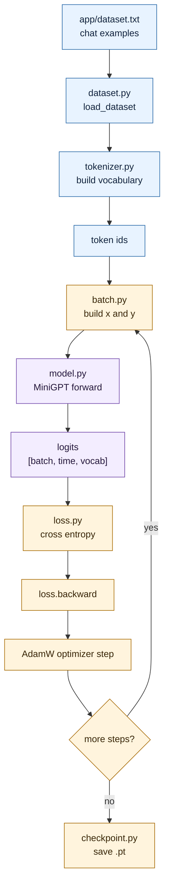

# The Training Loop: Where Learning Happens

All the pieces are in place. The training loop ties them together and runs the whole process from start to finish.

## Where This Lives

```txt
app/train.py
```

## What Happens, Step by Step

Run `python app/train.py` and this is what executes:

1. **Load the dataset:** read `app/dataset.txt` into memory
2. **Build the vocabulary:** collect every unique character from the text
3. **Encode the text:** convert all characters to token IDs
4. **Create the model:** build a fresh `MiniGPT` with random weights
5. **Create the optimizer:** set up AdamW to handle weight updates

Then the loop begins:

6. **Sample a random batch:** pick random windows of text from the encoded dataset
7. **Forward pass:** feed the batch through the model to get logits
8. **Compute loss:** compare predictions against the correct next tokens
9. **Backpropagate:** trace the error back through the network, compute gradients
10. **Update weights:** AdamW adjusts every parameter slightly
11. **Log progress:** print the current loss
12. **Repeat:** go back to step 6

After all steps complete:

13. **Save a checkpoint:** store the model weights, vocabulary, and config to disk

## Diagram



## The Training Log

While training runs, you'll see output like this:

```txt
[INFO] train: vocabulary size=54
[INFO] train: sequence length=3791
[INFO] train: learning rate=0.003
[INFO] train: step=10  loss=3.1204
[INFO] train: step=20  loss=2.6870
[INFO] train: step=30  loss=2.4103
```

Loss should generally go down. It might be noisy — jumping around a little — but the trend should be downward.

## What Is a Batch?

Instead of training on one example at a time, we train on many simultaneously. A **batch** is a group of training examples processed together. This is faster and produces more stable gradients.

In `app/config.py`:

```txt
batch_size = 16   (process 16 examples at once)
block_size = 64   (each example is 64 characters long)
```

## Important Settings in `app/config.py`

| Setting | What it controls |
|---|---|
| `block_size` | How many characters the model can see at once |
| `embedding_dim` | Size of each token's vector |
| `num_heads` | Number of attention heads |
| `num_layers` | How many transformer blocks to stack |
| `max_steps` | How many training updates to run |
| `learning_rate` | How aggressively weights are updated |

Try changing `max_steps` to train longer and watch if loss goes lower.

## Why the Dataset Is Small

Training on a small dataset is intentional. The goal is study, not power. Small data = fast training = easy to experiment and observe. You can retrain from scratch in under a minute.

## What You Should Be Able to Explain

- The sequence of steps in one training iteration
- What a batch is and why we use them
- Why loss going down means the model is improving
- What you'd change to train longer or with a bigger model

<!-- COURSE_THREAD_START -->
## Course Thread

Previous: [Loss and Backpropagation](08_loss_and_backpropagation.md) explains how prediction error updates weights.

Next: [Checkpoint and Weights](11_checkpoint_and_weights.md) saves the learned state so inference can reuse it.

<!-- COURSE_THREAD_END -->
