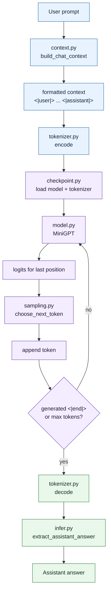

# Inference: The Model Answers Your Question

Training is over. Weights are saved. Now you want to actually use the model.

**Inference** is the process of using a trained model to generate text. No more learning happens here — just predicting, one character at a time.

## Where This Lives

```txt
app/infer.py
```

## How to Run It

Ask a pizza question:

```bash
python app/infer.py --prompt "What pizza do you recommend?"
```

Ask something outside the training domain:

```bash
python app/infer.py --prompt "What is the capital of France?"
```

See the full raw generated conversation:

```bash
python app/infer.py --raw-model --prompt "What pizza do you recommend?"
```

## The Autoregressive Loop

The model generates text one character at a time. Here's the full loop:

1. Take your prompt: `"What pizza do you recommend?"`
2. Format it as a conversation with markers:
   ```txt
   <|user|>
   What pizza do you recommend?
   <|assistant|>
   ```
3. Encode to token IDs
4. Feed into the model → get logits (scores for each possible next character)
5. Pick one character based on those scores (sampling)
6. Add it to the sequence
7. Go back to step 4 with the longer sequence
8. Stop when the model generates `<|end|>` or we hit the max token limit

This is called **autoregressive** generation because each step feeds on the output of the previous one.

## Diagram



## Two Output Modes

**Normal mode:** returns only the assistant's answer:

```txt
I recommend the Margherita pizza.
```

**Raw mode** (`--raw-model`): returns the entire generated conversation transcript:

```txt
<|user|>
What pizza do you recommend?
<|assistant|>
I recommend the Margherita pizza.
<|end|>
```

Both modes use the same model. The difference is just which part of the output gets shown.

## Why the Output Might Be Weird

This model is tiny. It was trained for a few minutes on a small pizzeria dataset. If it generates strange text, that's expected and educational.

Things to inspect if the output is poor:

- How long did training run? (Check `max_steps` in `config.py`)
- What was the final loss?
- Is the checkpoint fresh?
- Is the `temperature` setting high (more random) or low (more predictable)?
- Does the dataset have enough examples of the kind of question you're asking?

Fixing these things is how you improve an LLM — not by hardcoding answers.

## What You Should Be Able to Explain

- What "autoregressive" means
- Why the model generates one character at a time
- The difference between normal mode and raw mode
- Why output quality depends on training data and model size

<!-- COURSE_THREAD_START -->
## Course Thread

Previous: [Checkpoint and Weights](11_checkpoint_and_weights.md) stores weights, config, and vocabulary.

Next: [OpenAI API Layer](12_openai_api_layer.md) exposes that generation behind an HTTP chat contract.

<!-- COURSE_THREAD_END -->
