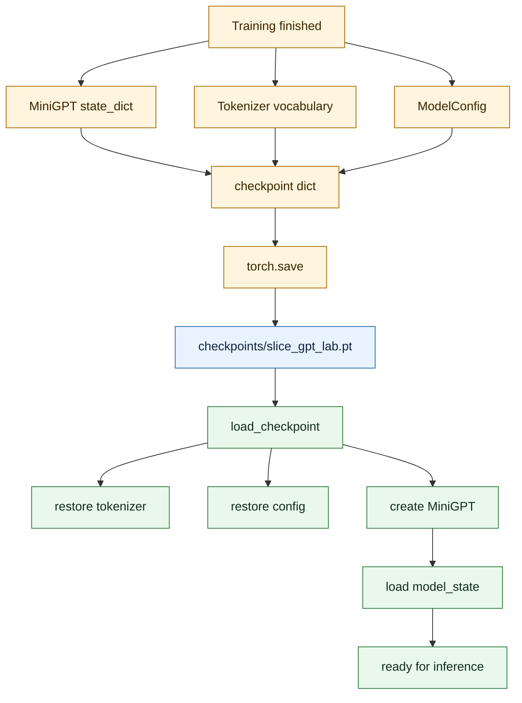

# Checkpoint and Weights: Saving What the Model Learned

Training takes time. Inference needs the result. A **checkpoint** is the bridge between them — a file that stores everything the model learned.

## Where This Lives

```txt
app/checkpoint.py
```

## What Gets Saved

The checkpoint stores three things:

### 1. Model Weights (`model_state`)
These are the actual learned numbers — every embedding value, every attention weight, every feed-forward parameter. Millions of small numbers, all tuned by training to minimize loss.

This is the model's "knowledge." Without it, the model is just random noise.

### 2. Vocabulary (`vocabulary`)
The mapping between characters and their token IDs. This is essential because the same character must always map to the same ID during inference.

If you trained on a vocabulary where `'a'` = `8`, then at inference time `'a'` must still be `8`. Otherwise the model reads garbage.

### 3. Config (`config`)
The model's shape: how many layers, how big the embedding dimension, how many attention heads. Without this, you can't rebuild the model structure to load the weights into.

## Where the Checkpoint Goes

```txt
checkpoints/slice_gpt_lab.pt
```

This file is excluded from Git (it's in `.gitignore`) because it's a runtime artifact — generated by running `train.py`, not part of the source code.

## Diagram



## The Analog: Saving a Game

A checkpoint is like a save file in a video game.

- **Model weights** = your character's stats and inventory (everything learned)
- **Vocabulary** = the key to read the save file correctly
- **Config** = the game settings needed to load the level

Without the save file, you'd have to start from scratch every time.

## Atomic Saving: Protecting Against Corruption

`save_checkpoint()` doesn't write directly to the final file. It writes to a temporary file first, then renames it to the real destination. This is called an **atomic save**.

Why? If the program crashes halfway through writing, you don't end up with a half-written, corrupted checkpoint. The old file stays intact until the new one is complete.

## What Happens If the Checkpoint Is Missing

If you run inference without training first, the loader will raise an error. It won't silently produce garbage — it fails clearly so you know what went wrong.

## What You Should Be Able to Explain

- Why a checkpoint needs to store vocabulary alongside model weights
- Why config must also be saved
- What atomic saving protects against
- Where the checkpoint file lives and why it's not in Git

<!-- COURSE_THREAD_START -->
## Course Thread

Previous: [Training Loop](09_training_loop.md) runs the repeated learning process.

Next: [Inference](10_inference.md) reloads them to generate text token by token.

<!-- COURSE_THREAD_END -->
